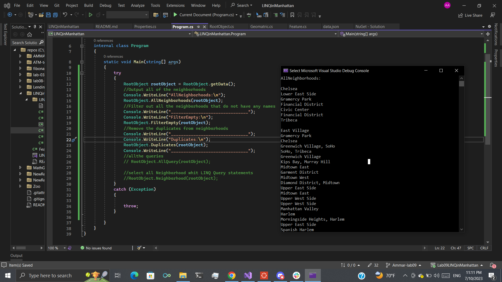

# JSON in Manhattan
## Introduction
This application receives data from an external file and can filter the data depending on predetermined settings. This software uses an external JSON file that contains all of the information about Manhattan.

The Manhattan Project is launching a service to collect data about Manhattan in New York City, such as zip codes, cities, addresses, neighborhoods, etc., and display it in various ways. It will also filter the data and return specific data.

## Usage
System.IO : 
Contains types that allow reading and writing to files and data streams, and types that provide basic file and directory support, The function need to use in project is File.ReadAllText,

~~~b
using System.IO;
~~~
File.ReadAllText:
Its method reads the entire contents of a text file
~~~b
string info = File.ReadAllText("Path");
~~~

Newtonsoft.Json : Is namespace provides classes that are used to implement the core services of the framework,It to converts an object to and from JSON, Need to use JsonConvert.DeserializeObject .
~~~b
using Newtonsoft.Json;
~~~

JsonConvert.DeserializeObject : Deserializes the JSON to a .NET object. Return Type object.
~~~b
RootObject data = JsonConvert.DeserializeObject<RootObject>(st);
~~~

This is the full implementation for function to read data from external file and return object holding all JSON data.
~~~b
public static RootObject getData()
            {
                string info = File.ReadAllText("path");
                RootObject data = JsonConvert.DeserializeObject<RootObject>(info);

                return data;
            }
~~~
## JSON and Classes 

JSON : is referred to Javascript Object Notation and is used to transport and store data. You frequently need to transform JSON text data to class objects in our program.
The names of the data fields in the JSON file and the names of the class properties must  match in order to convert the string into a class object. The class should be as follows to transform the JSON file mentioned above:

### RootObject Class

Contain properties type and List<Feature> claa.

~~~b
        public class RootObject
        {
            public string type { get; set; }

            public List<Feature> features { get; set; }
        }
~~~

Also contain filtering data functions :

1. ### AllNeighborhoods:
Its void function to print all Neighborhoods data in console, Get all of the neighborhoods in the JSON data .

~~~b
public static void AllNeighborhoods(RootObject rootObject)
            {
                var data = rootObject.features.Select(t => t.properties);
                var allneighborhood = data.Select(n => n.neighborhood);
                foreach (var item in allneighborhood)
                {
                    Console.WriteLine(item);
                }
            }
~~~

2. ### FilterEmpty : 
Its void function to print all Neighborhoods data in console without empty Neighborhoods value, Filter out all the neighborhoods that do not have any names .

~~~b

public static void FilterEmpty(RootObject rootObject)
            {
                var data = rootObject.features.Select(t => t.properties);
                var neighborhood = data.Where(n => n.neighborhood != "").Select(n => n.neighborhood);
                foreach (var item in neighborhood)
                {
                    Console.WriteLine(item);
                }
            }
~~~

3. ### Duplicates : Its void function to print all Neighborhoods data in console without Duplicates Neighborhoods value, Remove the duplicates from neighborhoods

~~~b

public static void Duplicates(RootObject rootObject)
            {
                var data = rootObject.features.Select(t => t.properties);
                var neighborhood = data.Select(n => n.neighborhood).Distinct();
                foreach (var item in neighborhood)
                {
                    Console.WriteLine(item);
                }
            }
~~~

### Feature class

Contain properties : 
- string type
- Properties properties
- Geometry geometry

~~~b

public class Feature
        {
            public string type { get; set; }
            public Geometry geometry { get; set; }
            public Properties properties { get; set; }
        }
~~~

Now need to have class for each prop in Feature class

### Geometry class

Contain properties : 
- string type
- Double list coordinates

~~~b

public class Geometry
        {
            public string type { get; set; }
            public List<double> coordinates { get; set; }
        }
~~~

### Properties class

Contain properties : 
- string zip
- string city
- string state
- string address
- string borough
- string neighborhood
- string county
~~~b

public class Properties
        {
            public string zip { get; set; }
            public string city { get; set; }
            public string state { get; set; }
            public string address { get; set; }
            public string borough { get; set; }
            public string neighborhood { get; set; }
            public string county { get; set; }
        }
~~~

## solution

